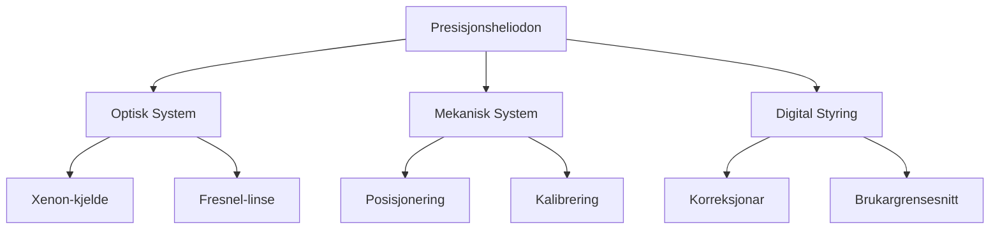
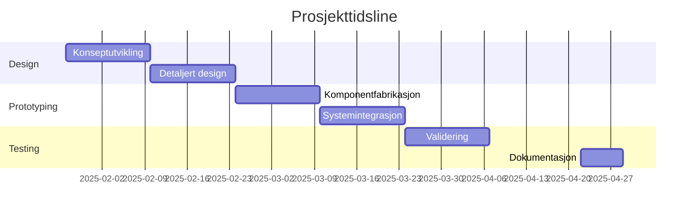

# heliodon
*Kategori: Teknologi og Mekanikk*

## Introduksjon
Dette prosjektet representerer ei systematisk tilnærming til utfordringa med presis solsimulering. Gjennom innovativ bruk av optikk og presisjonsmekanikk skapar me eit instrument som opnar for djupare forståing av samspelet mellom arkitektur og naturleg lys.

## Kva (Prosjektidentitet)

### Systemkonsept

### Nøkkelkomponentar
1. **Optisk System**
   - Xenon-basert punktlyskjelde
   - Presisjonskollimasjon via Fresnel-linse
   - Parallell strålegang (>95% nøyaktigheit)

2. **Mekanisk Struktur**
   - Breiddegradjustering (0° til ±90°)
   - Deklinasjonsjustering (-23.5° til +23.5°)
   - Timevinkeljustering (0° til 360°)

3. **Digital Kontroll**
   - Atmosfærisk refraksjonskorreksjon
   - Elliptisk banekompensasjon
   - Presisjonsposisjonering (±0.1°)

## Kvifor (Motivasjon)

### Samfunnsverdi
> "Bygningar står for nesten 40% av globalt energiforbruk. Gjennom betre forståing av sollys kan me dramatisk redusere dette talet."

1. **Energieffektivitet**
   - Optimalisering av dagslysforhold
   - Reduksjon av kunstig belysning
   - Termisk regulering

2. **Forskingsverdi**
   - Presis solbanesimulering
   - Arkitektoniske studiar
   - Utdanningsformål

3. **Innovasjonsaspekt**
   - Ny tilnærming til presisjonsoptikk
   - Integrert digital styring
   - Open kjeldekode-utvikling

## Korleis (Plan)

### Utviklingsfasar

#### Fase 1: Design (Februar)
- Optisk systemutvikling
  - Strålegangsanalyse
  - Komponentval
  - Simuleringar

- Mekanisk design
  - CAD-modellering
  - Strukturanalyse
  - Materialspesifikasjonar

#### Fase 2: Prototyping (Mars)
- Komponentfabrikasjon
  - Presisjonsmaskinering
  - Optisk montering
  - Elektrisk integrasjon

- Systemintegrasjon
  - Modulær montering
  - Kalibreringsprosedyrar
  - Første funksjonstest

#### Fase 3: Testing (April)
- Systemvalidering
  - Presisjonsverifisering
  - Brukargrensesnittesting
  - Dokumentasjon

### Tekniske Spesifikasjonar

| Parameter | Verdi | Toleranse |
|-----------|-------|-----------|
| Vinkeloppløysing | 0.1° | ±0.05° |
| Lysnøyaktigheit | >95% | ±2% |
| Repeterbarheit | 0.05° | ±0.02° |

### Ressursar og Verktøy

1. **Materialar**
   - Presisjonsmaskinert aluminium
   - Karbonfiber-komponentar
   - Optisk-grade glas

2. **Utstyr**
   - CNC-maskin
   - 3D-printer
   - Optisk måleutstyr

3. **Programvare**
   - SolidWorks for mekanisk design
   - MATLAB for optiske simuleringar
   - Arduino IDE for systemkontroll

## Milepælar

## Dokumentasjon

### Formidlingsplattformer
- GitHub: Teknisk dokumentasjon
- Instagram: Visuell prosessdokumentasjon
- Teknisk rapport: Omfattande systemdokumentasjon

### Delingsformat
- 3D-modellar og teikningar
- Programvarekode og algoritmar
- Kalibreringsprotokoll
- Brukarrettleiing

---

*Prosjektansvarleg: [Namn]*
*Innleveringsdato: 27. januar 2025*
